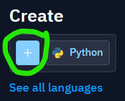
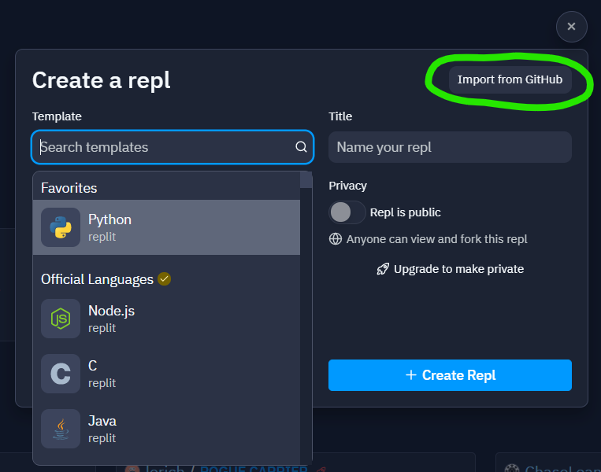
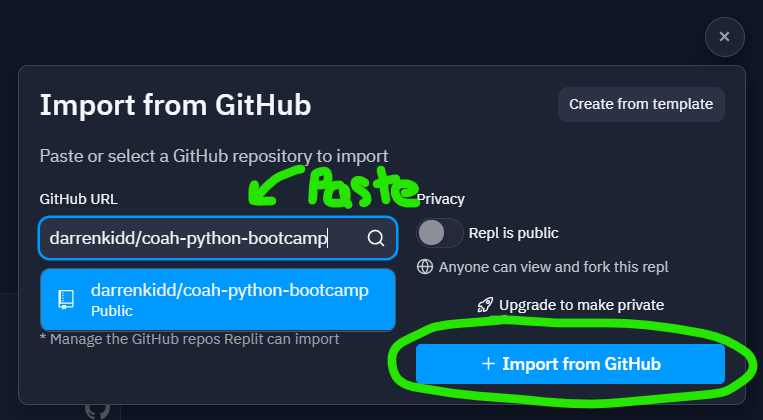

# City on a Hill Python Bootcamp

A fun introduction to the joys of programming with Python 3. No planking.


## Importing into repl.it

We will be using [repl.it](https://repl.it/) as our coding platform. It's free,
and you don't have to install anything on your computer. This makes it super easy
for us to get started!

> :warning: **Note that the free tier doesn't allow for private Repls, so everything will be
> visible to anyone who finds your code. Don't write anything private in there!**

To start with, go to the link above, and then click on the **+** button near "Create":



Select the **Import from GitHub** button on the top-right.



Type in **`darrenkidd/coah-python-bootcamp`** as the GitHub URL and then click **Import from GitHub**:



This should set everything up for you.

## Why Python?

Python is an easy-to-read, simple, yet powerful language, which makes it a wonderful
language to start learning with. Once you know the basics, there is so much you can
do with it!

It's also become incredibly popular in the last decade because of it's applications
in data science and machine-learning/artificial-intelligence. In addition, it provides
excellent libraries for _integrating_ APIs/services/websites into your own custom
workflows. This is why programming is such a key skill to learn, today!

## Layout

1. Each **lesson folder** will contain all of the individual (working) steps we
will progress through during the lesson. Feel free to go have a look if you get
stuck. It also contains the lesson notes.
1. The **`main.py`** file is really just a scratch-pad for you to use in repl.it.
That's where most of the editing and learning will be done.

### Links to Lesson Notes

* [Lesson 1 - The Basics, Weather API and Refactoring :hatched_chick:](./lesson1/LESSON1_NOTES.md)

## Advanced Stuff

:fire: :fire: :fire:

### Running with Docker Locally

If you run a very lean local development environment (as I do), you may find
these Docker commands useful when testing the scripts.

```bash
$ docker build -t coah-bc -<<EOF
FROM python:3.8.2-slim-buster
RUN pip install requests
WORKDIR /usr/src/myapp
EOF
$ MSYS_NO_PATHCONV=1 docker run -it --rm -v "$(pwd)":/usr/src/myapp coah-bc python main.py
```
